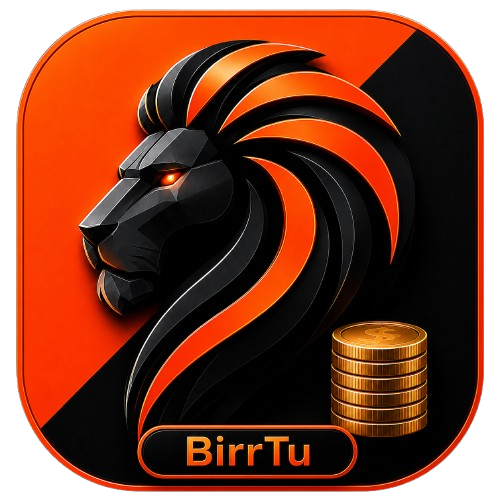

# <p align="center"><br/>BirrTu (ብርቱ)</p>

<p align="center">
  <strong>The Premium, Privacy-First Personal Ledger & Budget Tracker for the Ethiopian Financial Ecosystem</strong>
</p>

<p align="center">
  <a href="https://github.com/BirtuCan-Software/birrtu-app"></a>
  <a href="https://github.com/BirtuCan-Software/birrtu-app/issues"></a>
  <a href="https://github.com/BirtuCan-Software/birrtu-app/blob/main/LICENSE"></a>
</p>

<p align="center">
  
  
  
  
  
  
</p>

---

## 🇪🇹 About BirrTu (ብርቱ)

**BirrTu** is a privacy-first, offline-first personal financial ledger tailored precisely for the modern Ethiopian banking and mobile wallet ecosystem. Engineered to run entirely within your browser's sandboxed environment, BirrTu bypasses centralized databases and remote trackers, keeping 100% of your financial logs securely stored on your physical device.

For users seeking seamless multi-device persistence, BirrTu supports **isolated, secure backups** directly to your private, hidden Google Drive AppData directory.

---

## ✨ Features Spotlight

### 🔒 100% Client-Side Sandbox Privacy
Your transaction ledgers and balance histories reside entirely inside standard client-side `IndexedDB` storage. No backend trackers can harvest, trace, or leak your financial details.

### 💳 Ethiopian Banking & Wallet Presets
Zero-setup presets custom-styled for key financial platforms in Ethiopia:
- **Commercial Bank of Ethiopia (CBE)**
- **Telebirr**
- **CBE Birr**
- **Awash Bank**
- **Dashen Bank / Hibret Bank / COOP / Cooperative Bank of Oromia**
- **Physical Cash Pouches**

### 📂 Multi-Account Workspaces
Organize your life into independent financial scopes (e.g., *Personal*, *Freelance Business*, *Family Household*) and swap between workspaces with zero friction.

### ☁️ Secure, Hidden Google Drive Sync
Signed-in workspaces sync automatically through independent, per-device journals
inside your Google Account's hidden `appDataFolder`. Wallets, transactions,
settings, deletion tombstones, and portable PIN verifiers are merged only with
records carrying the same stable workspace identity. Guest workspaces remain
local-only.

### 📊 Beautiful Analytics & Interactive Statistics
Interactive financial breakdown charts, dynamic spending category rings, and monthly budget trajectory trends to help you monitor cash flow at a glance.

### 📄 Comprehensive Portability
Generate clean, official PDF bank ledger reports or download your complete database as raw JSON files for cold, offline archives.

---

## ⚙️ Core Technical Architecture

```
                 ┌────────────────────────────────────────────────────────┐
                 │                  React 19 View Layer                   │
                 └───────────────┬────────────────────────┬───────────────┘
                                 │                        │
                ┌────────────────▼────────────────┐      ┌▼──────────────────────────────┐
                │      IndexedDB Storage (idb)    │      │    Google Drive Integration   │
                │     (Transactions, Wallets)     │      │   (Encrypted Cloud Sync App)  │
                └─────────────────────────────────┘      └───────────────────────────────┘
```

- **Frontend Core:** React 19 + TypeScript (strict types)
- **Bundler:** Vite 6 + Tailwind CSS CSS-in-JS configuration
- **Animation Suite:** `motion` (Framer Motion API wrapper)
- **Storage Subsystem:** Local browser IndexedDB (wrapped cleanly using the `idb` client helper library)
- **Visual Analytics:** Recharts Engine
- **Report Generation:** jsPDF client compiler

---

## 💻 Local Installation & Setup Guide

Ensure you have **Node.js v18+** and **npm v9+** installed on your workstation.

### 1. Clone the Repository
```bash
git clone https://github.com/BirtuCan-Software/birrtu-app.git
cd birrtu-app
```

### 2. Install Project Dependencies
```bash
npm install
```

### 3. Setup Local Environment Variables
The app reads Firebase settings directly from Vite env vars, so put your project values in `.env.development` for local work and `.env.production` for production builds:
```env
# Local Server URL
APP_URL="https://ais-dev-7wb32p6p2vg5tfn7gykhvh-58167563393.europe-west1.run.app"

# Firebase Web Client Credentials (Development)
VITE_FIREBASE_API_KEY="your_firebase_api_key"
VITE_FIREBASE_AUTH_DOMAIN="your_firebase_auth_domain"
VITE_FIREBASE_PROJECT_ID="your_firebase_project_id"
VITE_FIREBASE_STORAGE_BUCKET="your_firebase_storage_bucket"
VITE_FIREBASE_MESSAGING_SENDER_ID="your_firebase_messaging_sender_id"
VITE_FIREBASE_APP_ID="your_firebase_app_id"

# Google Identity Services OAuth web client (for Drive reconnection)
VITE_GOOGLE_CLIENT_ID="your_google_oauth_web_client_id"
```
If you want to override values locally without touching tracked files, create an ignored `.env.local` file.

### 4. Fire Up the Dev Server
```bash
npm run dev
```
Open [http://localhost:3000](http://localhost:3000) in your web browser.

### 5. Compile Static Assets for Production
```bash
npm run build
```
Optimized assets compile in the `/dist` directory.

---

## 🚀 Apache / cPanel Production Deployment Guide

Since BirrTu is built entirely as a Single Page Application (SPA), it does not require an active Node.js server in production. You can host it on any standard Apache web server.

### static Web Hosting Steps

1. **Build the Assets:** Run `npm run build` on your machine.
2. **Compress files:** Compress the **contents** of the generated `/dist` folder directly into a `.zip` file (e.g., `birrtu-release.zip`). *Ensure `index.html` resides at the root of the .zip folder.*
3. **Upload to File Manager:** Log in to your cPanel File Manager and upload your `.zip` directly into the web root (usually `public_html` or a mapped subdomain directory).
4. **Extract:** Extract the uploaded `.zip` folder.
5. **Dynamic Fallback Routing (.htaccess):** Since React uses client-side routing, manual page reloads (e.g. hitting refresh on `/settings`) will yield a 404 error from Apache. To bypass this, create or open a `.htaccess` file in your root folder and add this fallback rule:

```apache
<IfModule mod_rewrite.c>
  RewriteEngine On
  RewriteBase /
  RewriteRule ^index\.html$ - [L]
  RewriteCond %{REQUEST_FILENAME} !-f
  RewriteCond %{REQUEST_FILENAME} !-d
  RewriteRule . /index.html [L]
</IfModule>
```

---

## 📂 Version Control Guidelines

- **`.env.development` is explicitly tracked in Git** to provide immediate onboarding profiles.
- **`.env.production` is strictly blocked** in `.gitignore` to prevent any production secrets leakage.
- Firebase config is read from those env files directly; no separate `firebase-applet-config.json` is used.
- **`.gitignore`** is fully audited to skip node modules, log streams, localized configurations, and editor settings.

To bind your directory and commit to the remote repository, run:
```bash
git init
git add .
git commit -m "Initial Commit: BirrTu Premium Offline Financial Ledger"
git branch -M main
git remote add origin https://github.com/BirtuCan-Software/birrtu-app.git
git push -u origin main
```

---

## ⚖️ License & Attribution

Licensed under the **MIT License**. Created with care by the team at [BirtuCan Software](https://birtucansoftware.com). All rights reserved.
